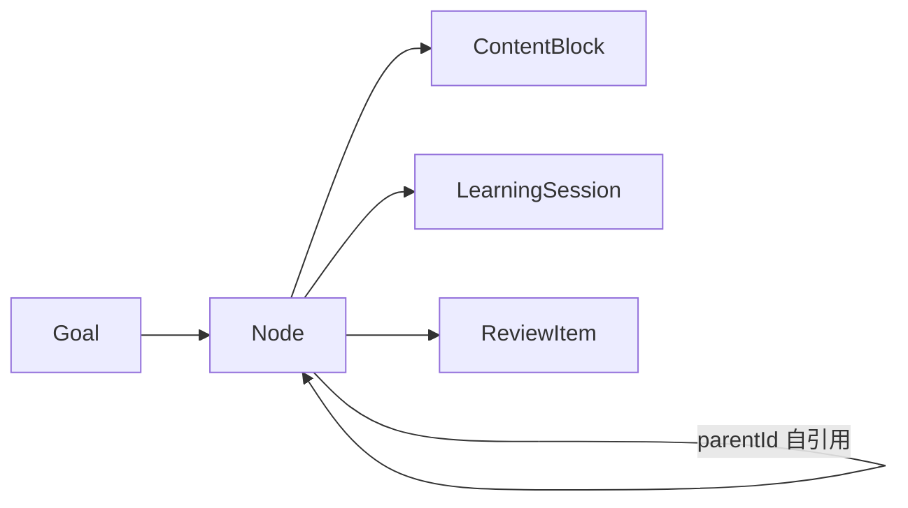
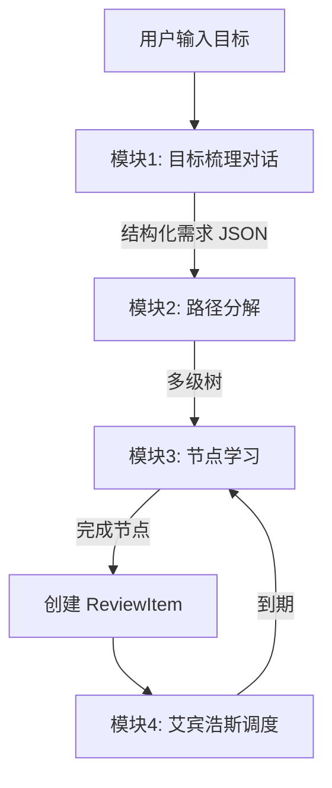

# 自适应学习软件 MVP 方案

## 1. 技术栈与项目结构

- **框架**：Next.js 14 App Router + TypeScript + Tailwind + shadcn/ui
- **数据**：Prisma + SQLite（本地文件 `dev.db`，零部署成本）
- **状态**：Zustand（轻量）+ TanStack Query（服务端数据缓存）
- **AI 抽象层**：`lib/llm/` 下定义 `LLMProvider` 接口，先实现一家适配器（推荐 DeepSeek，国内可用且便宜），通过 `LLM_PROVIDER` 环境变量切换
- **内容渲染**：`react-markdown` + `mermaid` + `next/image`，Slide/3D 预留组件占位

目录骨架：

```text
adaptive-study/
├── app/
│   ├── (dashboard)/page.tsx                      # 首页：目标卡片 + 今日复习徽章
│   ├── (dashboard)/goals/new/page.tsx            # 目标梳理对话
│   ├── (dashboard)/goals/[id]/page.tsx           # 路径树 + 进度全景
│   ├── (dashboard)/goals/[id]/nodes/[nodeId]/page.tsx  # 学习节点页
│   ├── (dashboard)/reviews/page.tsx              # 复习页
│   └── api/
│       ├── goals/route.ts
│       ├── goals/[id]/clarify/route.ts           # 流式追问
│       ├── nodes/decompose/route.ts              # 子节点生成
│       ├── nodes/[id]/content/route.ts           # 多模态内容生成
│       ├── nodes/[id]/complete/route.ts          # 完成 → 创建 ReviewItem
│       └── reviews/[id]/grade/route.ts           # 复习自评 → 更新间隔
├── components/
│   ├── ui/                                       # shadcn
│   ├── path-tree.tsx                             # 可展开折叠的目标树
│   ├── content-renderer/{markdown,mermaid,image,slide,three}.tsx
│   └── review-card.tsx
├── lib/
│   ├── llm/{index,openai,deepseek,mock}.ts
│   ├── prompts/{clarify,decompose,content,review}.ts
│   ├── ebbinghaus.ts
│   └── db.ts
├── prisma/schema.prisma
└── seed/ai-programmer-transition.ts              # 预置测试场景
```

## 2. 数据模型（[prisma/schema.prisma](prisma/schema.prisma)）

核心实体关系：



关键字段：

- `Goal`：`title`, `clarification`（JSON：currentLevel/weeklyHours/priorities/expectedOutcome）, `status`
- `Node`：`goalId`, `parentId`, `title`, `summary`, `kind`（`objective | topic | concept | action`）, `isLeaf`, `order`, `status`（`pending | in_progress | completed`）, `estimatedMinutes`
- `ContentBlock`：`nodeId`, `kind`（`markdown | image | mermaid | slide | three`）, `payload`（JSON）, `order`
- `LearningSession`：`nodeId`, `startedAt`, `completedAt`, `userNotes`
- `ReviewItem`：`nodeId`, `intervalDays`, `easeFactor`, `reviewCount`, `lastReviewedAt`, `nextReviewAt`, `lastGrade`

## 3. 四模块流程



### 模块 1：目标梳理（[app/(dashboard)/goals/new/page.tsx](app/(dashboard)/goals/new/page.tsx)）

- 用户输入"AI 新时代的程序员转型学习路径"
- 后端 prompt（`lib/prompts/clarify.ts`）让 LLM 按固定 schema 提问：当前水平、每周可投入小时、最在意的方向、期望产出形式、deadline
- 至多 3 轮对话，最终返回 JSON 写入 `Goal.clarification`

### 模块 2：路径分解（[lib/prompts/decompose.ts](lib/prompts/decompose.ts) + [app/api/nodes/decompose/route.ts](app/api/nodes/decompose/route.ts)）

prompt 显式给出**分解终止标准**：

1. 节点是单一概念/术语（"MVP 概念"、"REST 风格"）
2. 节点是一个具体可操作步骤（"用 Postman 发起 GET 请求"）
3. 预估学习时长 ≤ 30 分钟
4. 再拆会引入与父节点重复的内容

LLM 输出每个子节点必须带 `isLeaf: boolean` + `kind` + `estimatedMinutes`，由后端校验后落库。前端的 `path-tree.tsx` 对非叶子节点显示"展开"按钮，按需调用分解 API（懒分解，节省 token）。

首次创建目标后，仅对一级目标做分解；二级及以下用户主动展开时再调用。

### 模块 3：学习执行（[app/(dashboard)/goals/[id]/nodes/[nodeId]/page.tsx](app/(dashboard)/goals/[id]/nodes/[nodeId]/page.tsx)）

- 点击叶子节点 → 检查 `ContentBlock` 是否已缓存，否则调用 `/api/nodes/[id]/content`
- LLM 根据 `node.kind` 选择模板：
  - `concept`：定义 + 类比 + 例子 + Mermaid 概念图 + 3 道自检题
  - `action`：步骤清单 + 关键截图占位 + 验收标准
- 返回 ContentBlock 数组（顺序渲染）。`slide` 和 `three` 类型 MVP 阶段不生成，组件内显示"即将上线"占位，保留 schema 兼容
- 完成按钮 → `POST /api/nodes/[id]/complete` → 状态变 `completed`、创建 `ReviewItem`（首次间隔 1 天）

### 模块 4：复习（[lib/ebbinghaus.ts](lib/ebbinghaus.ts) + [app/(dashboard)/reviews/page.tsx](app/(dashboard)/reviews/page.tsx)）

- 简化版 SM-2 算法：

```ts
const INITIAL_INTERVALS = [1, 2, 4, 7, 15, 30]; // 天，超过则按 ease 递增
function nextInterval(item, grade /* 'forgot' | 'vague' | 'fluent' */) {
  if (grade === 'forgot') return { intervalDays: 1, ease: Math.max(1.3, item.easeFactor - 0.2) };
  if (grade === 'vague')  return { intervalDays: item.intervalDays, ease: item.easeFactor };
  const idx = item.reviewCount;
  const base = INITIAL_INTERVALS[idx] ?? Math.round(item.intervalDays * item.easeFactor);
  return { intervalDays: base, ease: Math.min(2.8, item.easeFactor + 0.05) };
}
```

- 复习页展示：原节点摘要 + LLM 当场生成的 3 道复习题（不缓存，保证多样性）
- 自评后 `POST /api/reviews/[id]/grade` 写新的 `nextReviewAt`
- 浏览器 Notification API（用户授权后）每天首次访问时检查并提醒，无需后台服务

## 4. LLM 抽象层（[lib/llm/index.ts](lib/llm/index.ts)）

```ts
export interface LLMProvider {
  chat(opts: { system?: string; messages: Msg[]; json?: boolean }): Promise<string>;
  chatStream(opts: { system?: string; messages: Msg[] }): AsyncIterable<string>;
  generateImage?(prompt: string): Promise<string>; // 返回 URL/base64
}
```

- `openai.ts` / `deepseek.ts` 实现同一接口
- `mock.ts` 返回固定 fixture，方便无网络情况下跑通流程与测试
- 工厂根据 `process.env.LLM_PROVIDER` 选择，默认 `mock`

## 5. 测试场景预置（[seed/ai-programmer-transition.ts](seed/ai-programmer-transition.ts)）

- `prisma db seed` 时插入一条 `Goal`：标题"AI 新时代的程序员转型"
- 一级 6 个 `Node`（已存在、`isLeaf: false`）：产品思维、设计思维、软件开发技能、测试技能、运维技能、商业化技能
- 其中 1-2 个二级节点预拆好（如"产品思维 → MVP 概念 / 用户访谈方法"），并预生成 ContentBlock，让用户**零等待**即可体验完整执行+复习流
- 其余分支保持未展开，演示懒分解与 LLM 实时生成

## 6. 环境与运行

- `.env.example`：`LLM_PROVIDER=mock`、`OPENAI_API_KEY=`、`DEEPSEEK_API_KEY=`、`DATABASE_URL="file:./dev.db"`
- 启动：`pnpm i && pnpm prisma migrate dev && pnpm prisma db seed && pnpm dev`
- README 写清如何切换到真实 LLM

## 7. MVP 边界（明确不做）

- 用户登录/多端同步（本地 SQLite 单机）
- 真实 Slide 渲染、3D 动画（仅占位组件 + schema 预留）
- 移动端适配优化（响应式可用但不深度打磨）
- 离线 PWA、付费、协作
